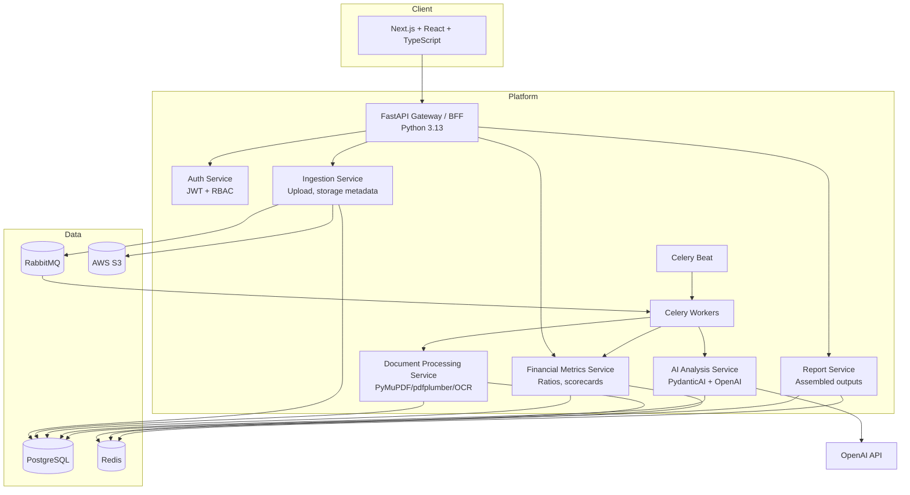
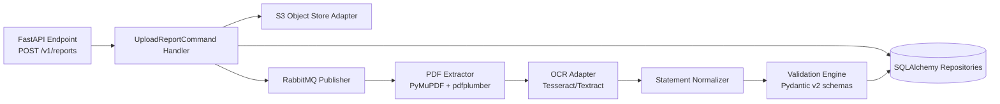
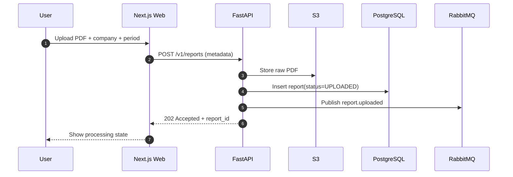
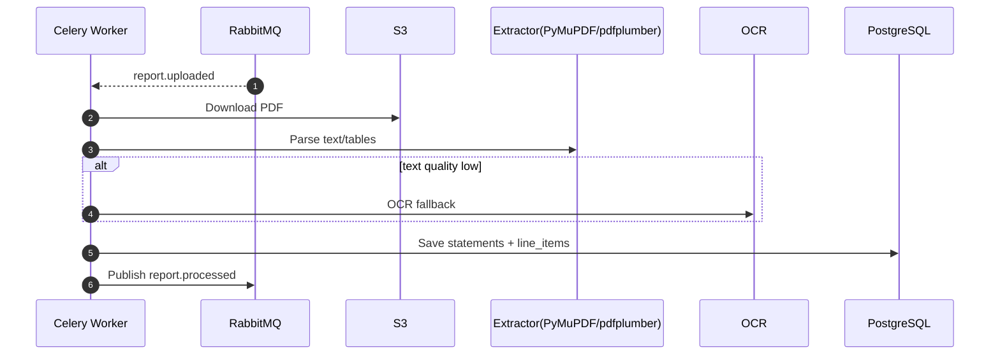
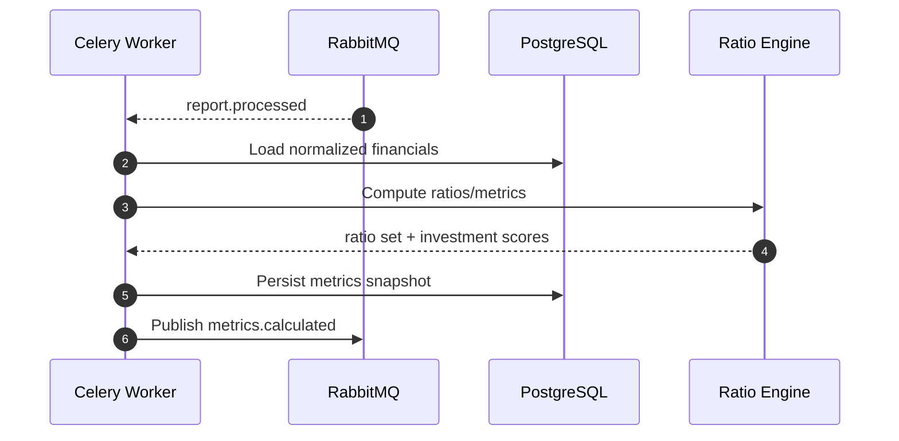
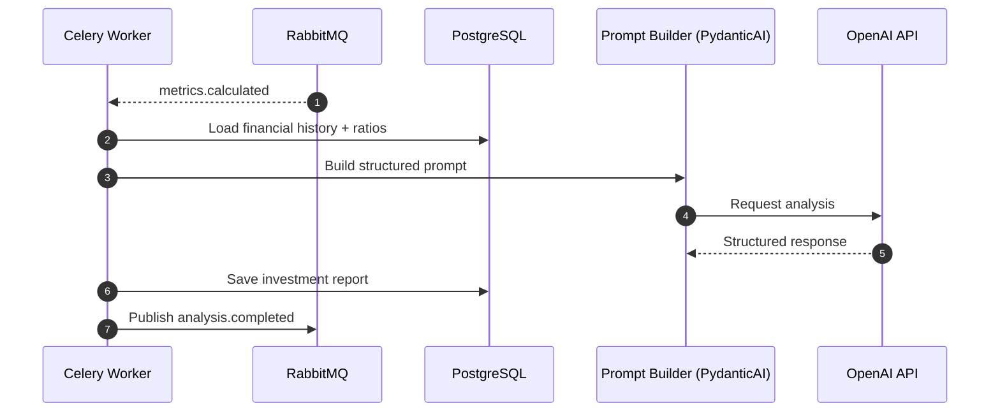
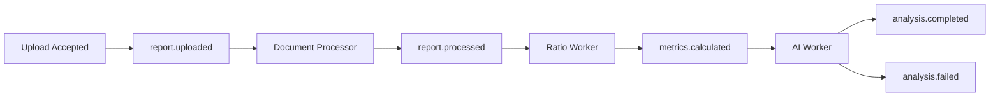
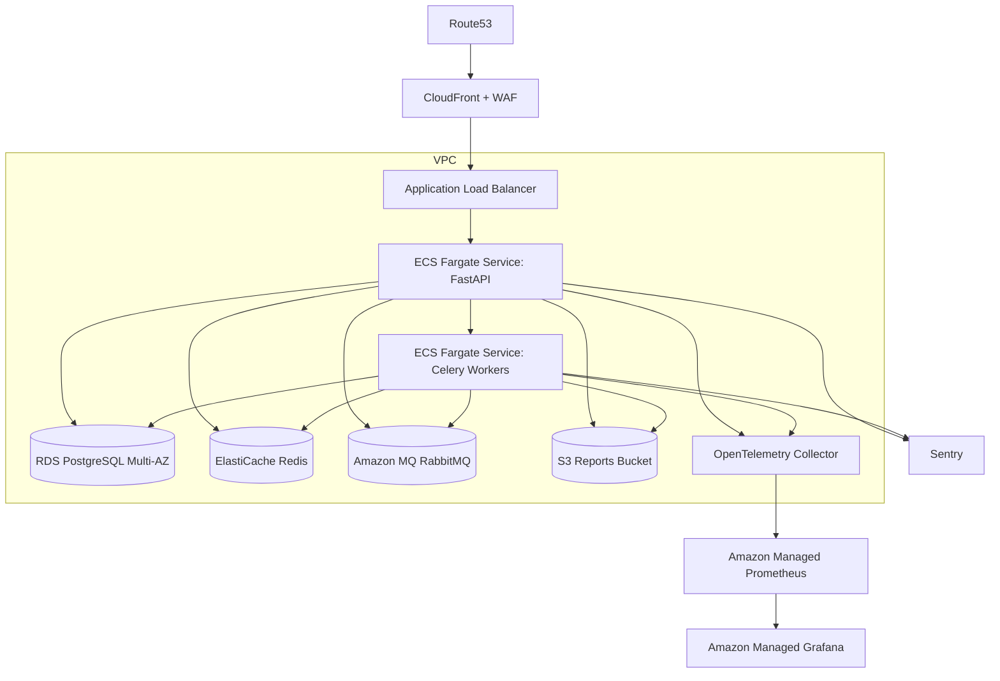
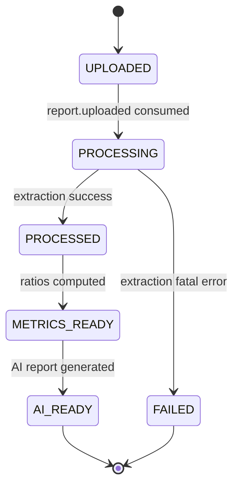

# FinSight — Production Architecture Blueprint

This repository contains the target architecture for a **financial statement analysis platform** focused on publicly traded companies.

## 1) Architecture Style

- **Domain Driven Design (DDD)** with bounded contexts:
  - Ingestion
  - Document Intelligence
  - Financial Modeling
  - AI Research
  - Identity & Access
- **Clean Architecture** per service:
  - `domain` (entities, value objects, domain services)
  - `application` (use cases, orchestration)
  - `infrastructure` (SQLAlchemy repos, Redis cache, RabbitMQ adapters, OpenAI clients)
  - `interfaces` (FastAPI REST, background message handlers)
- **Event-driven + async processing** using RabbitMQ + Celery for long-running work.

---

## 2) C4 — System Context Diagram

```mermaid
flowchart LR
    Investor[Investor / Analyst]
    Admin[Platform Admin]
    FinSight[FinSight Platform]
    EDGAR[SEC EDGAR / Company IR Sites]
    OpenAI[OpenAI API]
    Email[Email / Notification Provider]

    Investor -->|Upload reports, request analysis, view dashboards| FinSight
    Admin -->|Manage tenants, users, limits, prompts| FinSight
    FinSight -->|Fetch source filings metadata (optional)| EDGAR
    FinSight -->|LLM inference for qualitative analysis| OpenAI
    FinSight -->|Send completion/failure notifications| Email
```

---

## 3) C4 — Container Diagram



---

## 4) C4 — Component Diagram (Document Processing Service)



---

## 5) Sequence Diagrams

### 5.1 Report Upload



### 5.2 Document Processing



### 5.3 Ratio Calculation



### 5.4 AI Report Generation



---

## 6) Database Schema (PostgreSQL, SQLAlchemy 2, Alembic)

### Core Tables

- `tenants(id, name, plan, created_at)`
- `users(id, tenant_id, email, password_hash, status, created_at)`
- `roles(id, name)`
- `user_roles(user_id, role_id)`
- `companies(id, ticker, cik, name, exchange, sector)`
- `reports(id, tenant_id, company_id, report_type, fiscal_period, fiscal_year, source, s3_key, checksum, status, uploaded_by, uploaded_at, processed_at)`
- `report_pages(id, report_id, page_no, text_content, ocr_confidence)`
- `statements(id, report_id, statement_type, currency, unit_scale)`
- `line_items(id, statement_id, taxonomy_key, label, value, period_end, confidence, source_page)`
- `ratio_definitions(id, code, name, formula, category, enabled)`
- `ratio_results(id, company_id, report_id, ratio_code, value, computed_at)`
- `investment_scores(id, company_id, report_id, model_version, score, rationale_json)`
- `ai_reports(id, company_id, report_id, model, prompt_version, summary_md, risks_md, opportunities_md, created_at)`
- `jobs(id, job_type, reference_id, status, retries, error_message, started_at, finished_at)`
- `audit_logs(id, tenant_id, actor_id, action, resource_type, resource_id, payload_json, created_at)`

### Indexing / Constraints

- Unique: `(company_id, report_type, fiscal_year, fiscal_period)` on `reports`
- Unique: `(company_id, report_id, ratio_code)` on `ratio_results`
- Partial index on `jobs(status)` for active job polling
- GIN index on `to_tsvector('english', report_pages.text_content)` for full-text search.
- Query guidance:
  - Use `websearch_to_tsquery` for end-user keyword search UX.
  - Use `plainto_tsquery` for sanitized plain text input.
  - Use `to_tsquery` for advanced power-user boolean syntax.
- Tradeoff: full-text indexing improves search latency but increases index storage and INSERT/UPDATE cost.
- Tenant isolation baseline: enforce `tenant_id` predicates in all repository queries.
- Tenant isolation evolution: start with app-layer isolation for MVP, then enable PostgreSQL RLS for enterprise/regulatory tenants or multi-team admin environments.
- RLS tradeoff: better defense in depth with modest query-planning overhead from RLS policies.

---

## 7) Event-Driven Architecture

Events are immutable facts with `event_id`, `trace_id`, `tenant_id`, `occurred_at`, `schema_version`, `payload`.



### Reliability Pattern

- Outbox table in PostgreSQL + publisher relay to RabbitMQ.
- Consumer idempotency table (`processed_events`) to deduplicate.
- Dead-letter queues for poison messages.
- Exponential retry with bounded attempts and alerting.

---

## 8) RabbitMQ Topology

### Exchanges

- `finsight.domain` (topic)
- `finsight.retry` (topic)
- `finsight.dlx` (topic)

### Queues and Routing Keys

- Queue `q.doc.process` ← `report.uploaded`
- Queue `q.metrics.calculate` ← `report.processed`
- Queue `q.ai.generate` ← `metrics.calculated`
- Queue `q.notifications` ← `analysis.completed`, `analysis.failed`
- Queue `q.audit` ← `*.created`, `*.updated`, `*.deleted`

### DLQ

- `q.doc.process.dlq`, `q.metrics.calculate.dlq`, `q.ai.generate.dlq`
- Route from primary queues via dead-letter policy after max retries.

---

## 9) Celery Worker Design

Worker pools:

1. `worker-ingestion` (I/O heavy): file integrity checks, metadata extraction.
2. `worker-docproc` (CPU heavy): PDF parsing + OCR.
3. `worker-metrics` (CPU/memory moderate): ratio and scoring engine.
4. `worker-ai` (network bound): OpenAI inference with rate limiting.
5. `worker-notify` (I/O bound): email/webhook notifications.

Recommended Celery config:

- `acks_late=True`, `task_reject_on_worker_lost=True`
- Separate queues per worker type
- Prefetch tuned by workload (`1` for docproc, higher for I/O workers)
- Soft/hard time limits for OCR and LLM calls
- Redis as Celery result backend (short retention only).

---

## 10) REST API Design (FastAPI)

### Auth & Users

- `POST /v1/auth/login`
- `POST /v1/auth/refresh`
- `POST /v1/auth/logout`
- `GET /v1/users/me`

### Companies & Reports

- `POST /v1/companies`
- `GET /v1/companies/{company_id}`
- `GET /v1/companies?ticker=...`
- `POST /v1/reports` (multipart upload)
- `GET /v1/reports/{report_id}`
- `GET /v1/reports/{report_id}/status`
- `GET /v1/companies/{company_id}/reports`

### Financial Data & Analytics

- `GET /v1/reports/{report_id}/statements`
- `GET /v1/reports/{report_id}/ratios`
- `GET /v1/companies/{company_id}/ratios/history`
- `POST /v1/reports/{report_id}/recalculate`

### AI Analysis

- `POST /v1/reports/{report_id}/ai-analysis`
- `GET /v1/reports/{report_id}/ai-analysis`
- `GET /v1/companies/{company_id}/investment-summary`

### Ops

- `GET /health/live`
- `GET /health/ready`
- `GET /metrics` (Prometheus scrape)

---

## 11) Authentication & Authorization

- **AuthN**: JWT access tokens + refresh tokens; optional SSO (OIDC/SAML for enterprise).
- **AuthZ**: RBAC with roles (`admin`, `analyst`, `viewer`) and tenant scoping.
- **Security controls**:
  - Password hashing with Argon2id.
    - Recommended baseline: `memory_cost=65536 KiB (~ 64 MiB)`, `time_cost=3`, `parallelism=4`.
    - Tune from benchmark results; target roughly sub-200ms verification on production hardware to balance security and UX.
    - Load-test under concurrent authentication to validate memory headroom.
  - Signed JWT keys in AWS KMS/Secrets Manager.
  - Short-lived access tokens + refresh token rotation.
  - API rate limiting (Redis token bucket).
  - Audit logs for privileged actions.

---

## 12) AWS Deployment Architecture



---

## 13) CI/CD Pipeline (GitHub Actions)

1. **PR pipeline**
   - Ruff/Black/isort/mypy
   - Pytest (unit + integration with Testcontainers)
   - Frontend lint/typecheck/tests
   - Trivy image scan + dependency scan
2. **Main branch pipeline**
   - Build multi-stage Docker images
   - Push to ECR
   - Run Alembic migration checks
   - Deploy to staging (ECS) via OIDC role
   - Smoke tests
3. **Production promotion**
   - Manual approval gate
   - Blue/green or canary release
   - Automatic rollback based on SLO alarms.

---

## 14) Monitoring, Logging, Tracing

- **Metrics**: Prometheus + custom business metrics (processing latency, extraction confidence, queue depth).
- **Tracing**: OpenTelemetry traces from API → RabbitMQ → Celery → OpenAI.
- **Logs**: Structured JSON logs shipped to CloudWatch/OpenSearch.
- **Errors**: Sentry for backend/frontend exception tracking.
- **SLO examples**:
  - P95 upload-to-analysis completion < 10 min.
    - Completion boundary: from successful `POST /v1/reports` acceptance to persisted `analysis.completed` event with AI report stored.
    - Scope: includes queue wait + processing time under normal load for standard-size filings; define separate large-document SLO tiers.
  - API error rate < 1%
  - Queue lag < 2 min for standard plan.

---

## 15) Clean Architecture + DDD Application

- Domain models independent of FastAPI/ORM/queue frameworks.
- Use cases expose ports; adapters implement ports.
- Each bounded context has its own module and anti-corruption layer.
- Shared kernel only for strongly common concepts (Money, FiscalPeriod, TenantId).
- Domain events emitted from aggregate roots and published through outbox.

---

## 16) Major Tradeoffs and Alternatives

1. **RabbitMQ + Celery vs Kafka + Faust/Streams**
   - Chosen for Python ecosystem maturity and operational simplicity.
   - Kafka better for very high-throughput replay/event-sourcing but adds ops complexity.

2. **PostgreSQL vs DynamoDB**
   - PostgreSQL chosen for relational integrity, SQL analytics, and strong transactional behavior.
   - DynamoDB could improve extreme-scale write throughput but complicates joins/reporting.

3. **PydanticAI + OpenAI vs self-hosted models**
   - OpenAI accelerates quality/time-to-market.
   - Self-hosted models reduce vendor lock-in and data exposure but require MLOps investment.

4. **ECS Fargate vs EKS**
   - Fargate minimizes ops overhead initially.
   - EKS preferred if needing deeper scheduling control and lower large-scale compute costs.

5. **PyMuPDF/pdfplumber + OCR vs external document AI**
   - In-house pipeline gives transparency and lower unit cost at scale.
   - Managed OCR/Document AI can increase extraction accuracy for complex tables with higher cost.

---

## 17) Additional Mermaid: Processing State Machine



---

## 18) Scaling Strategy to 1M Users

### Phase 1 (0–50k users)
- Single region, Multi-AZ RDS, autoscaled ECS services.
- Queue partitioning by task type.

### Phase 2 (50k–300k users)
- Read replicas for analytics queries.
- Redis caching for hot ratios and company summaries.
- Separate worker fleets by tenant tier.

### Phase 3 (300k–1M users)
- Multi-region active/passive for DR.
- Shard data by tenant segment or company universe.
- Introduce event streaming backbone (Kafka) for replay-heavy analytics.
- Dedicated model gateway with batching and budget controls.
- Add asynchronous API patterns (webhooks + SSE for job completion).

### Cross-phase controls
- Strict cost observability per tenant/job.
- Tenant-aware rate limits and quotas.
- SLO-driven autoscaling (queue lag + CPU + p95 latency).

---

## Testing Strategy (Pytest + Testcontainers)

- Unit tests for domain services (ratio formulas, scoring rules).
- Integration tests for SQLAlchemy repositories against PostgreSQL container.
- End-to-end async tests with RabbitMQ + Redis + Celery workers in Testcontainers.
- Contract tests for OpenAI responses using Pydantic schemas + mocked API.

This architecture is implementation-ready for a senior engineering team and aligned with the specified technology constraints.
